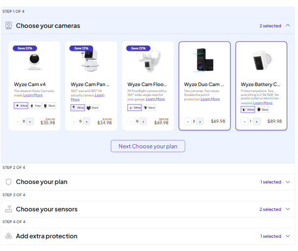
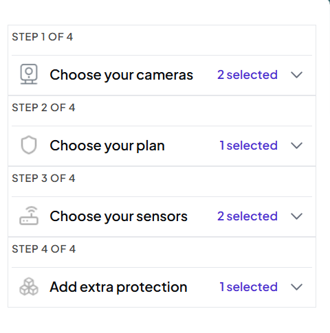

## Bundle Builder App ##
## Overview

An interactive product bundle configurator built with React, Zustand, and Tailwind CSS.
Users can customize their own security system by selecting cameras, plans, sensors, and accessories, with real-time price calculation and a live review panel.

## Live Features ##
- Multi-step accordion UI (Cameras → Plan → Sensors → Extras)
-  Product selection with quantity controls
- Variant selection (color/option switching)
- Real-time price calculation (subtotal, original total, savings)
- Live Review Panel summary
- Save configuration to LocalStorage
- Persistent state using Zustand persist middleware
- Product detail page ("Learn More")
- Fast UX with responsive design (mobile → desktop)

## Tech Stack ##

- React.js
- Zustand (State Management)
- React Router DOM
- Tailwind CSS
- React Hot Toast
- Vite

## Installation & Setup ##

- Clone the repo:
git clone [https://github.com/roaamounir/Bundle-Builder.git]

- Install dependencies:
npm install

- Run development server:
npm run dev

## Key Features Explained ##

- Product Selection Engine
Each product uses a unique key:
productId + variantId

This allows:
independent quantity tracking per variant
accurate state management

- Financial Calculation
Prices are calculated dynamically:
Subtotal
Original total
Total savings

Based on:
selectedItems + PRODUCT_LOOKUP_MAP

- Save System

User configuration is saved to:
localStorage → my-saved-systems

Includes:
selected items
timestamp
full bundle state

- State Management (Zustand)
Handles:
quantity updates
plan selection (single-choice logic)
persistence across refresh

## Responsive Design ##
Fully responsive layout:

Mobile: stacked layout
Tablet: adaptive grid
Desktop: 2-column layout (builder + review panel)

## Future Improvements ##
- Backend integration for saved bundles
- User authentication
- Checkout integration
- Compare bundles feature
- Animations for step transitions

### Preview

##  Project Highlights

- Scalable state architecture using Zustand
- Dynamic product system with variant-based keys
- Real-time financial calculations
- Clean separation of UI and business logic
